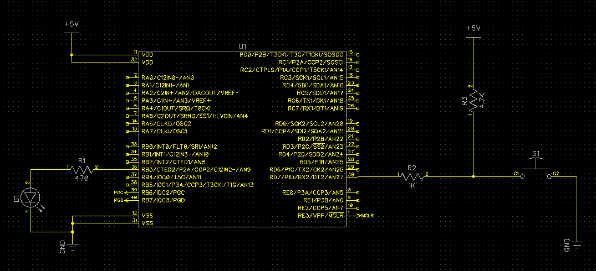

=============
1 Push to LED
=============

Source code folder: source/1_push_to_led

This project demonstrates IO functionality of PIC18F45K22 micro-controller.

What is expected:

* A push button NO (Normally Open) shall be attached to an IO pin.
* LED is connected to another IO pin.
* If the user pushes the Button, LED should lite up.

Download :download:`Schematics<schematics/1_push_to_led.pdf>`.

  *Push Buttons and LED Connection to PIC uC*