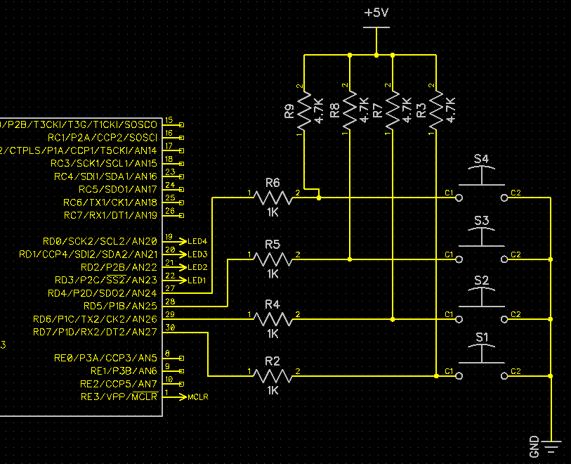

====================
2 Multiplt Push LEDS
====================

Source code folder: source/2_mult_push_leds

Another project demonstrating IO functionality of PIC18F45K22 micro-controller.

What is expected:

* 4 push buttons (Normally Open) shall be attached to 4 IO pins.
* 4 LEDs is connected to 4 IO pins.
* Each LEDs are assigned to a Push button.
* If the user pushes any Button the assigned LED should lite up.

Download :download:`Schematics<schematics/2_mult_push_leds.pdf>`.

In the source code Push buttons are assigned LED as listed below:

* Push Button S1 is assigned to LED D1.
* Push Button S2 is assigned to LED D2.
* Push Button S3 is assigned to LED D3.
* Push Button S4 is assigned to LED D4.

    *Push Buttons connection to PIC uC*

.. figure:: images/2_mult_push_leds_2.png

    *LEDs coneection to PIC uC*