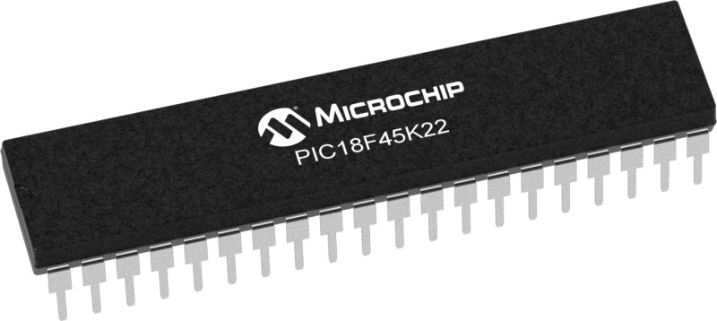

===========================================
Welcome to PIC18F45K22 Hack's documentation
===========================================

This project gives you an idea of how to hack into PIC18F45K22 Microcontroller.
You can use my template projects to create your own programs.

This documentation explains all the necessary information to set up your hardware
up to speed.

      *PIC18F56K22 DIP Package*

* Package Used: PDIP PIC18F45K22 (DigiKey Partnumber: PIC18F45K22-I/P-ND)
* :download:`Data Sheet for PIC18F45K22 <datasheets/PIC18F45K22 Datasheet RevG.pdf>`
* :download:`Debugger: PICKit3 Userguide <datasheets/PICkit3 User Guide.pdf>`
* :download:`Debugger Connection Schematics <schematics/PICKit3.pdf>`
* :download:`MPLAB C18 Compiler Library Userguide <datasheets/MPLAB C18 Libraries.pdf>`

Install MPLAB IDE/C18 Compiler:

* First Install :download:`MPLAB IDE <https://ww1.microchip.com/downloads/en/DeviceDoc/MPLAB_IDE_8_92.zip>`.
* Download and Install `C18 Lite Compiler <https://www.microchip.com/en-us/development-tool/SW006011>`_. You will have to register first.

.. toctree::
   :maxdepth: 10
   :caption: Projects:

   1_push_to_led
   2_mult_push_leds

==================
Indices and tables
==================

* :ref:`genindex`
* :ref:`modindex`
* :ref:`search`
